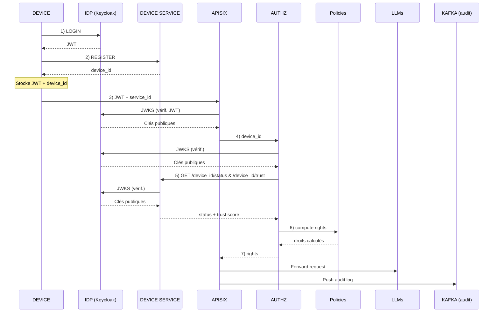
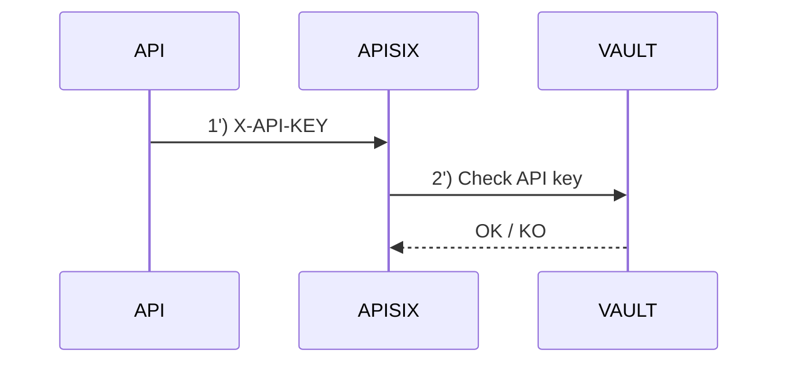
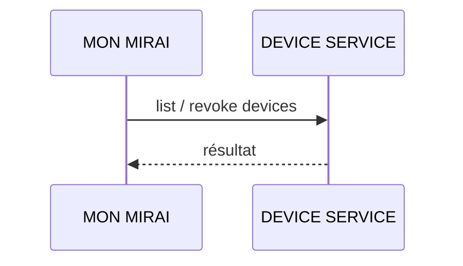

# Device Service - Sequence Diagrams

## 1. Device Flow

```mermaid
sequenceDiagram
    participant D as DEVICE
    participant IDP as IDP (Keycloak)
    participant DS as DEVICE SERVICE
    participant APISIX as APISIX
    participant AUTHZ as AUTHZ
    participant P as Policies
    participant LLMs as LLMs
    participant K as KAFKA (audit)

    D->>IDP: 1) LOGIN
    IDP-->>D: JWT

    D->>DS: 2) REGISTER
    DS-->>D: device_id

    Note over D: Stocke JWT + device_id

    D->>APISIX: 3) JWT + service_id

    APISIX->>IDP: JWKS (vérif. JWT)
    IDP-->>APISIX: Clés publiques

    APISIX->>AUTHZ: 4) device_id

    AUTHZ->>IDP: JWKS (vérif.)
    IDP-->>AUTHZ: Clés publiques

    AUTHZ->>DS: 5) GET /device_id/status & /device_id/trust
    DS->>IDP: JWKS (vérif.)
    IDP-->>DS: Clés publiques
    DS-->>AUTHZ: status + trust score

    AUTHZ->>P: 6) compute rights
    P-->>AUTHZ: droits calculés

    AUTHZ-->>APISIX: 7) rights

    APISIX->>LLMs: Forward request
    APISIX->>K: Push audit log
```

## 2. API Flow

```mermaid
sequenceDiagram
    participant API as API
    participant APISIX as APISIX
    participant V as VAULT

    API->>APISIX: 1') X-API-KEY
    APISIX->>V: 2') Check API key
    V-->>APISIX: OK / KO
```

## 3. Admin Flow

```mermaid
sequenceDiagram
    participant MM as MON MIRAI
    participant DS as DEVICE SERVICE

    MM->>DS: list / revoke devices
    DS-->>MM: résultat
```
